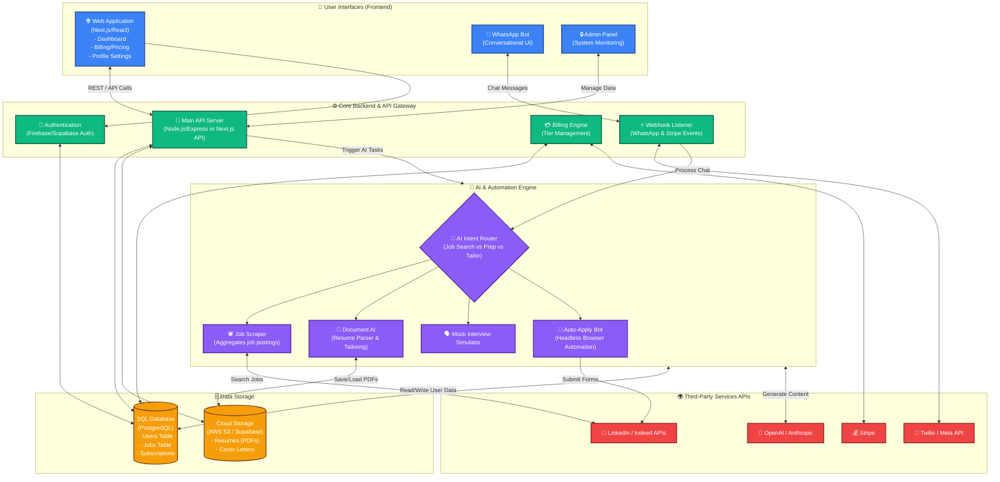

# JobPilot AI Full System Architecture

This diagram visualizes the **complete full-stack architecture** for the entire JobPilot AI platform. It shows how the user interfaces (Web and WhatsApp), the core backend, the databases, and the AI Automation Engine all connect together.

## System Components Breakdown

### 1. 📱 User Interfaces (Frontend)
This is where users interact with JobPilot AI.
- **Web Application:** The main site built with Next.js/React where users sign up, choose their subscription (Free/Pro/Elite), view their dashboard, and manage resumes.
- **WhatsApp Bot:** The conversational interface for on-the-go users to chat with the AI, get job alerts, and do mock interviews.
- **Admin Panel:** An internal dashboard for you to track active users, revenue, and system health.

### 2. ⚙️ Core Backend
The central nervous system of the platform.
- **API Server:** Handles requests from the Web App and coordinates with the database.
- **Authentication & Billing:** Manages user signups, logins, and communicates with Stripe to enforce Free, Pro, or Elite tier limits.
- **Webhooks:** Listens for incoming WhatsApp messages and Stripe payment confirmations.

### 3. 🗄️ Data Storage
Where all the state is securely kept.
- **SQL Database:** Stores structured data like user profiles, application history, job matches, and active subscription status.
- **Cloud Storage:** Stores actual files, like the user's original PDF resumes and the tailored PDFs generated by the AI.

### 4. 🧠 AI & Automation Engine
The "magic" behind JobPilot AI (This encompasses the flow from the previous diagram).
- **AI Intent Router:** Decides if the user is asking to search for jobs, tailor a resume, or practice an interview.
- **Document AI:** Uses LLMs to read a resume and rewrite it perfectly for a specific job description.
- **Job Scraper & Auto-Apply Bot:** Automatically searches for relevant jobs and (for Elite users) submits applications using automated browser scripts.

### 5. 🌍 Third-Party APIs
External tools the system relies on.
- **OpenAI:** For all intelligence, text generation, and intent parsing.
- **Stripe:** For securely handling subscription payments.
- **Meta/Twilio:** For sending and receiving WhatsApp messages.
- **Job Boards:** Where the jobs are actually sourced from (LinkedIn, Indeed, etc.).
