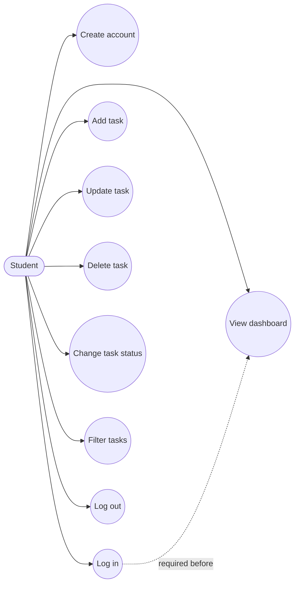
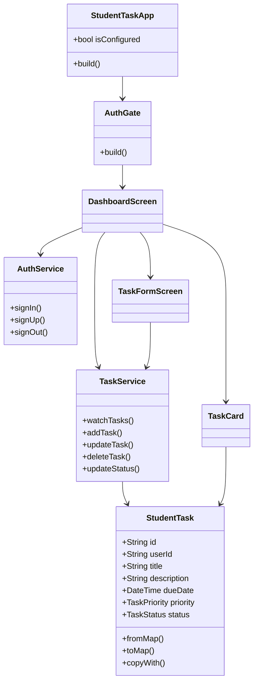

# Diagram Explanations

GitHub renders the Mermaid diagrams below directly in Markdown.

## Use case diagram



**Explanation:** The Student is the only actor. Registration and login establish identity. After login, the student can access all private task operations. Deletion includes a confirmation step inside the use case.

## ER diagram

```mermaid
erDiagram
    AUTH_USERS ||--|| USERS : "has profile"
    USERS ||--o{ TASKS : owns

    AUTH_USERS {
        uuid id PK
        string email
        string encrypted_password
    }
    USERS {
        uuid id PK_FK
        string full_name
        string email
        datetime created_at
    }
    TASKS {
        uuid id PK
        uuid user_id FK
        string title
        string description
        date due_date
        string priority
        string status
        datetime created_at
        datetime updated_at
    }
```

**Explanation:** Supabase owns `auth.users`. A trigger creates exactly one matching row in `public.users`. One public user can own many tasks, while each task has one required owner.

## Class diagram



**Explanation:** Screens depend on small services; services communicate with Supabase. `StudentTask` is the shared data model. Reusable widgets receive a task and callback functions, so they do not access the database directly.
